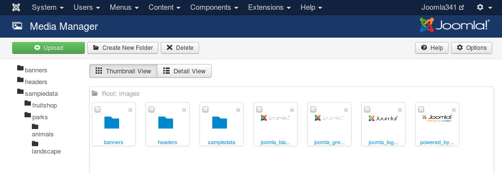
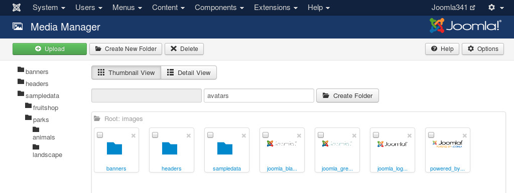
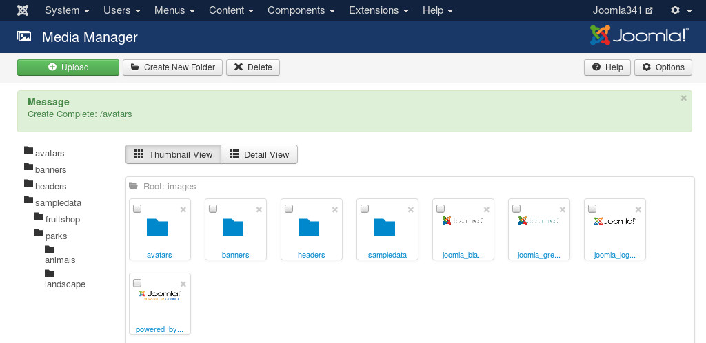
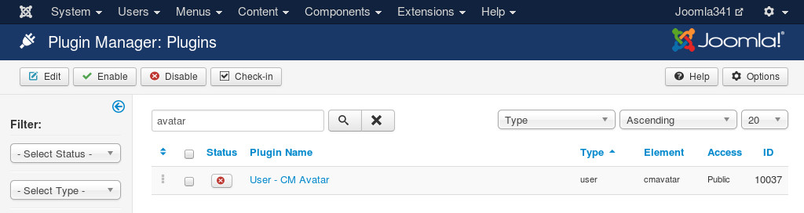
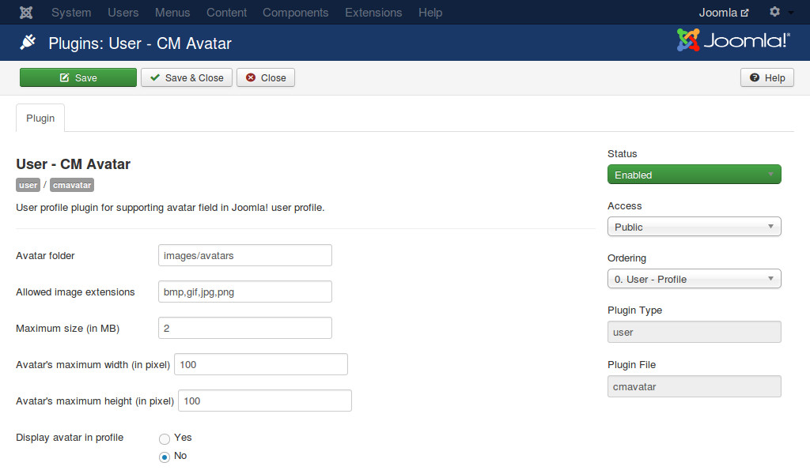
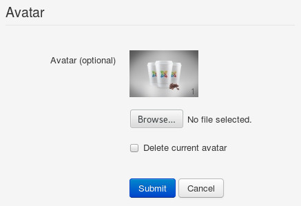
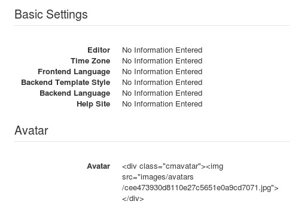

=============
Configuration
=============

Create avatar folder
--------------------

You need to create a folder where your users's avatar files are stored.

In your Joomla! back-end, you navigate to Content -> Media Manager, browse to the folder where you want to create the avatar folder.

Click "Create New Folder" button in the toolbar to create a new folder. Enter the folder name, click "Create Folder" to create.

Configure the plugin
--------------------

In your Joomla! back-end, you navigate to Extensions -> Plugin Manager, search for "avatar" to find the plugin quickly.

Click the plugin's name to configure.

On the right side, you set the "Status" option to "Enabled" to enable the plugin.

On the left side, you configure the following options:

* **Avatar folder**: The path to the folder where user avatars are stored, you create it in the step above. This path is relative to the root of your webspace. Example: images/avatars. **Note: Do not start the path with a slash!**
* **Allowed image extensions**: Extensions (file types) which are allowed to upload, the extensions are separated by comma, for example: bmp,gif,jpg,png.
* **Maximum size (in MB)**: The maximum size of image which is allowed to upload. **Note: your server also has its own maximum limit.**
* **Avatar's width (in pixel)**: The avatar file will be resized to this width. The height will be calculated and resized to keep the image's ratio.
* **Display avatar in profile**: Display the current avatar in profile view. By default this option is disabled because **it is not possible to display an image in profile view**. Please view :ref:`ref-display` section for solution.

After you save the plugin, you can see the options for uploading avatar when you edit your profile.

.. image:: ../images/profile_edit_new.jpg

After you upload an avatar, the avatar section in profile edit form looks similar to the below screenshot.

If you enable "Display avatar in profile" option in the plugin configuration, when you view your profile you don't see the avatar image, but you see the HTML code of it.

We have this problem because Joomla! doesn't support printing HTML for profile value, it is in "value" function in `components/com_users/helpers/html/users.php <https://github.com/joomla/joomla-cms/blob/staging/components/com_users/helpers/html/users.php#L28>`_) file::

	public static function value($value)
	{
		if (is_string($value))
		{
			$value = trim($value);
		}
		if (empty($value))
		{
			return JText::_('COM_USERS_PROFILE_VALUE_NOT_FOUND');
		}
		elseif (!is_array($value))
		{
			return htmlspecialchars($value);
		}
	}

Please view :ref:`ref-display` section for solution.
